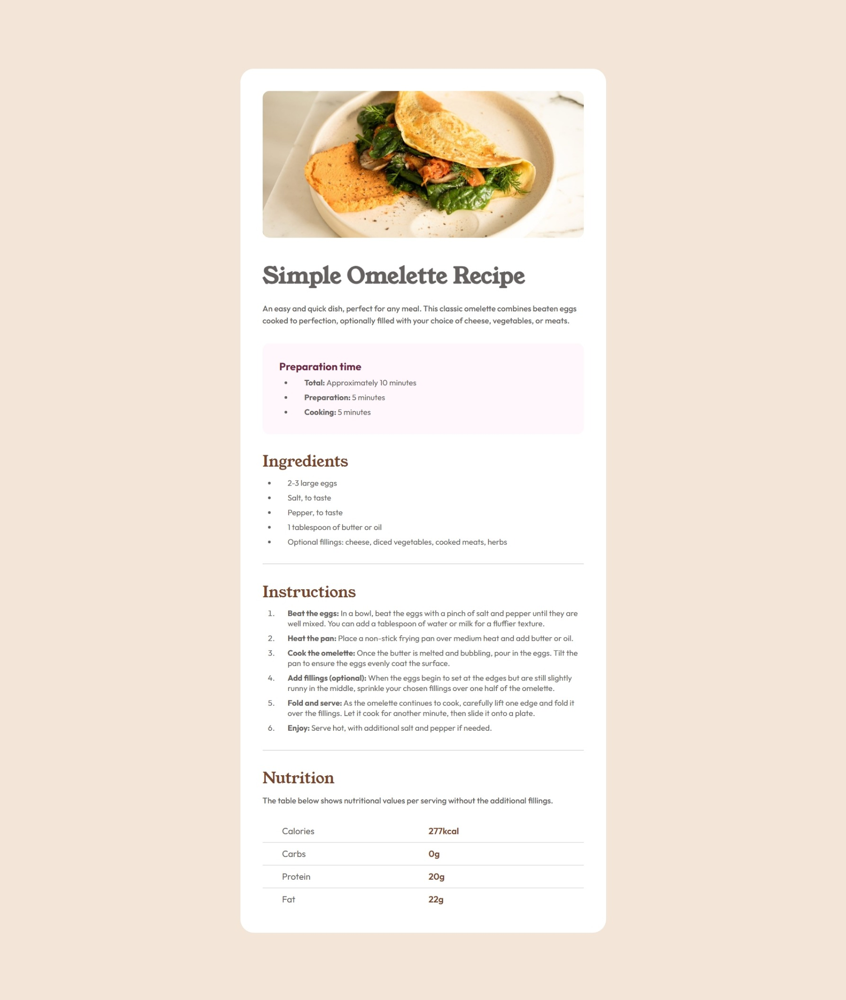
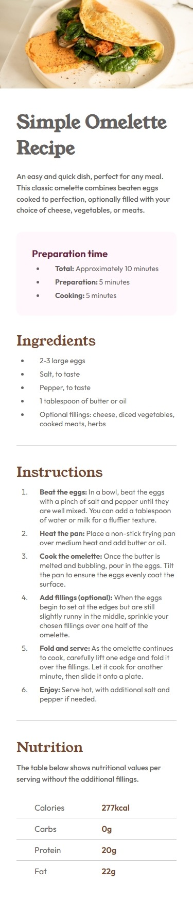

# Frontend Mentor - Solución a la página de recetas

Esta es una solución al [desafío de página de recetas en Frontend Mentor](https://www.frontendmentor.io/challenges/recipe-page-KiTsR8QQKm).  

## Tabla de contenidos

- [Visión general](#visión-general)  
  - [Captura de pantalla](#captura-de-pantalla)  
  - [Enlaces](#enlaces)  
- [Mi proceso](#mi-proceso)  
  - [Construido con](#construido-con)  
  - [Lo que aprendí](#lo-que-aprendí)  
- [Autor](#autor)  


## Visión general

### Captura de pantalla


| ||
|------------------------------------|----------------------------------|

### Enlaces

- URL de la solución: [Link](https://github.com/jeane-th/Pagina-de-recetas-fm)  
- URL del sitio en vivo: [Link](https://jeane-th.github.io/Pagina-de-recetas-fm/)  

## Mi proceso

### Construido con

- HTML5 semántico  
- Propiedades personalizadas de CSS  

### Lo que aprendí

Tablas y como darle estilos

Ejemplo de código:

```html
      <table class="table">
        <tr>
          <td>Calories</td>
          <td class="colums-rigth">277kcal</td>
        </tr>
        <tr>
          <td>Carbs</td>
          <td class="colums-rigth">0g</td>
        </tr>
        <tr>
          <td>Protein</td>
          <td class="colums-rigth">20g</td>
        </tr>
        <tr>
          <td>Fat</td>
          <td class="colums-rigth">22g</td>
        </tr>F
```
```css
.table {
    width: 100%;
    /* ancho completo */
    border-collapse: collapse;
}

.table td {
    border-bottom: 1px solid #ccc;
    /* bordes de celdas */
    padding-top: 10px;
    padding-bottom: 10px;
    text-align: left;
    /* alineación de texto */
    width: 50%;
}

.table tr:last-child td {
    border-bottom: none;
}

/* primera columna */
.table td:first-child {
    padding-left: 35px;
}

/* segunda columna */
.table td:last-child {
    color: #76462e;
    font-weight: 600;
    padding-left: 10px;
}
```

## Autor

- Sitio web - [Jeaneth Tafur](https://www.jeanethtafur.site)  
- Frontend Mentor - [@jeane-th](https://www.frontendmentor.io/profile/@jeane-th)